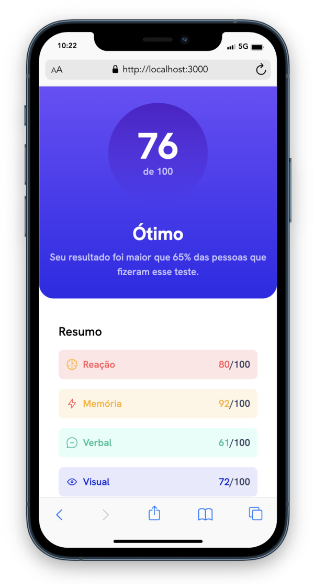
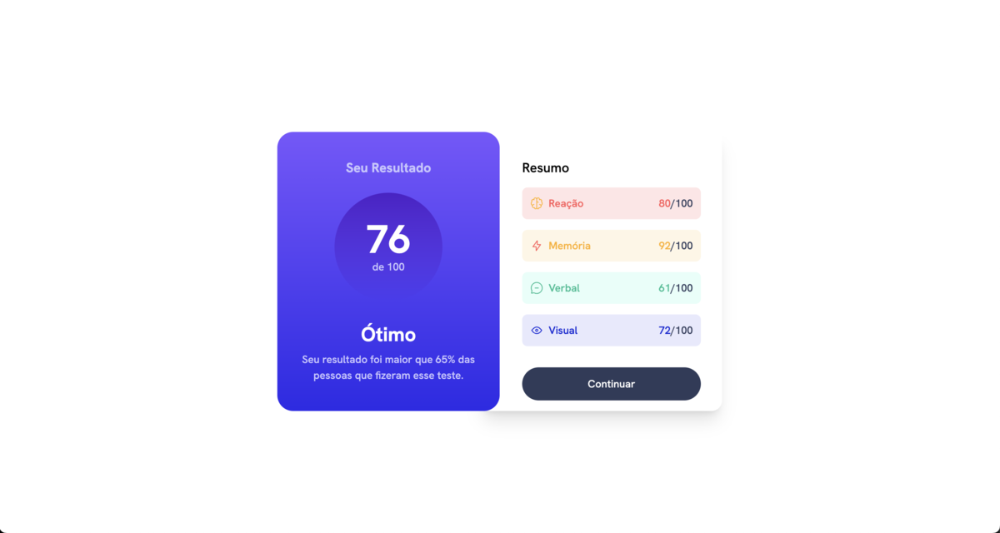

# Results Summary Component - React

Minha solução do [Results Summary Component | Frontend Mentor](https://www.frontendmentor.io/challenges/results-summary-component-CE_K6s0maV). 

[Versão ao Vivo](https://results-summary-react-component.netlify.app/)
[Github](https://your-live-site-url.com)

### Construído com

- Marcação HTML5 semântica
- Propriedades personalizadas de CSS
- Grid CSS
- Fluxo de trabalho Mobile-first
- [React](https://reactjs.org/) - Biblioteca JS
- [Tailwind](https://tailwindcss.com/) - Para estilos

### Imagens do projeto

## Meu Processo

Primeiro, avaliei qual seria a hierarquia de componentes. Em seguida, desenvolvi a versão estática do projeto e depois separei as partes em componentes reaproveitáveis. 

Fiz consultas na documentação oficial do React e Tailwind. 

### O que eu aprendi

1. **Design Mobile First com Tailwind:**
   Isso não apenas facilitou a adaptação do design para telas maiores, mas também contribuiu para uma experiência de usuário mais consistente e acessível.

2. **Aprendizado Ativo Através da Prática:**
   A máxima "aprender fazendo" fica cada vez mais evidente durante o desenvolvimento de novos projeto. Ter paciência, colocar a mão na massa e seguir estudando. Esse é o plano.

3. **Gerenciamento Adequado de Classes Dinâmicas:**
   Ao usar o Tailwind CSS, é mais eficaz e recomendado usar as classes predefinidas em vez de criar classes dinâmicas que se aplicam de forma condicional usando JSX. Isso garante que o sistema de classes do Tailwind funcione conforme o esperado e mantenha a coesão visual.

4. **Implementação de Componentes Reutilizáveis:**
   Por se tratar de um projeto pequeno, isso não fica tão evidente. Mas percebi que os componentes podem facilitar a manutenção e permite a criação de interfaces consistentes em projetos mais complexos.

### Desenvolvimento contínuo

Esse é o primeiro de muitos projetos com React. O plano é seguir estudando e colocar em prática. 

### Recursos úteis

 - https://youtu.be/PuovsjZN11Y
- [The BEST Way to Create Responsive Design with Tailwind CSS](https://youtu.be/PuovsjZN11Y) - Isso me ajudou a entender o por que desenvolver a versão mobile primeiro quando estamos utilizando Tailwind. Video claro e objetivo. 

- [Thinking in react](https://react.dev/learn/thinking-in-react) - A documentação do react é uma das melhores que vi por aí. E esse artigo me ajudou a estruturar meu desenvolvimento. 

## Autor

[Linkedin](https://linkedin.com/in/aecio-neto)
[Site Pessoal (desatualizado)](https://www.aecioneto.com.br)
